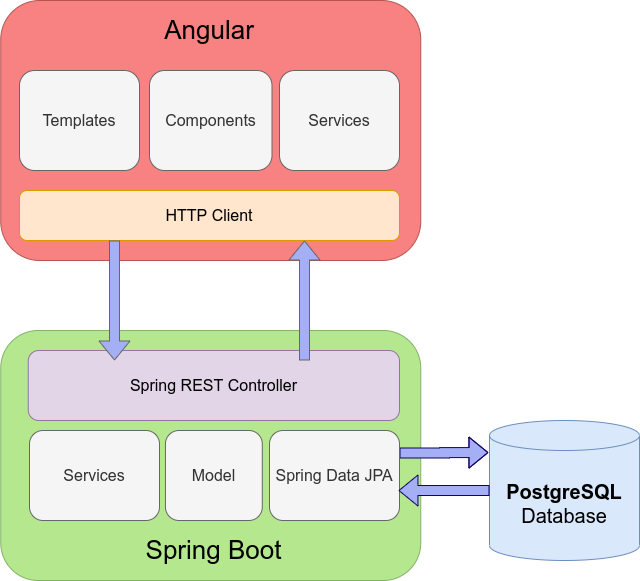

# Punto929.mx

## Descripción

El proyecto _Product Expiration Tracker - punto929.mx_ tiene como objetivo desarrollar un sistema de gestión de inventarios para productos con fechas de vencimiento. 
El sistema permitirá registrar productos, sus fechas de vencimiento y cantidades, generando alertas y reportes de productos próximos a vencer y con bajas cantidades de stock.

## Problema Identificado

La empresa enfrenta dificultades en la gestión manual de inventarios, lo que resulta en pérdidas de productos caducados y desabastecimiento de productos esenciales.

## Solución

Implementar un sistema automatizado que permita:
- Registro y actualización de productos.
- Registro de fechas de vencimiento y cantidades.
- Generación de alertas para productos próximos a vencer.
- Generación de reportes para productos con bajas cantidades de stock.

## Arquitectura

El sistema se basa en una arquitectura cliente-servidor con los siguientes componentes:
- **Frontend:** Interfaz de usuario desarrollada en Angular.
- **Backend:** API RESTful desarrollada en SpringBoot.
- **Base de Datos:** Postgres para el almacenamiento de datos.



## Tabla de Contenidos (ToC)

- [Descripción](#descripción)
- [Problema Identificado](#problema-identificado)
- [Solución](#solución)
- [Arquitectura](#arquitectura)
- [Requerimientos](#requerimientos)
- [Instalación](#instalación)
- [Configuración](#configuración)
- [Uso](#uso)
- [Contribución](#contribución)
- [Roadmap](#roadmap)

## Requerimientos

### Servidores
- Servidor de Aplicación: Apache Tomcat Embedded
- Servidor Web: SpringBoot
- Base de Datos: PostgresSQL
- Java
- Maven
- Docker
- Docker-Compose

### Paquetes adicionales
- Angular
- Nodejs
- React
- Nebular UI
- Spring Security
- JUnit

### Version de Node.js
- Node.js v14.20.0

## Instalación

### Ambiente de Desarrollo
1. Clona el repositorio:
    ```sh
    git clone https://github.com/Luzzambrano/product-expiration-tracker.git
    ```
2. Entra en el directorio del proyecto:
    ```sh
    cd product-expiration-tracker
    ```
3. Instala las dependencias:
   - Docker
   - Docker-
   
   Para iniciar la aplicación ejecuta el siguiente comando en un terminal:
   
    ```sh
    docker-compose up
    ``` 

    Para detener la aplicacion oprime CTRL+C y despues ejecuta

    ```sh
    docker-compose down
    ``` 

### Ejecutar pruebas manualmente
1. En el directorio de client-app

    ```sh
    npm install
    npm run test
    ```
2. Para el proyecto de 

    ```sh
    mvn clean test
    ```

### Implementación en Producción
1. Configura tu servidor para apuntar al directorio del proyecto.
2. Implementa el proyecto en un ambiente local o en la nube como Heroku.
3. Configura el despliegue continuo utilizando Travis CI.

## Configuración

### Archivos de configuración
- `.env`: Configuración de la base de datos.
- `docker-compose`: Crear maquinas virtuales (Docker) y ejecuta las aplicaciones en ambientes aislados.

### Configuración de Requerimientos
1. Configura las variables de entorno necesarias:
    ```sh
    export DB_HOST=localhost
    export DB_USER=root
    export DB_PASS=password
    export DB_NAME=punto929
    ```

## Uso

### Manual del Usuario Final
- [Manual del Usuario Final](docs/ManualUsuarioFinal.md)

### Manual del Usuario Final
- [Manual del Usuario Final](docs/ManualUsuarioFinal.md)

## Contribución

### Guía de Contribución
1. Clona el repositorio:
    ```sh
    git clone https://github.com/tu_usuario/punto929-product-management.git
    ```
2. Crea una nueva rama:
    ```sh
    git checkout -b feature/nueva-funcionalidad
    ```
3. Haz tus cambios y commitea:
    ```sh
    git commit -m "Descripción de los cambios"
    ```
4. Sube tu rama al repositorio remoto:
    ```sh
    git push origin feature/nueva-funcionalidad
    ```
5. Abre un Pull Request en GitHub.

## Roadmap
### Próximos Requerimientos
- Integración con sistemas de pago.
- Mejora en el sistema de notificaciones.
- Implementación de análisis predictivo para gestión de inventarios.